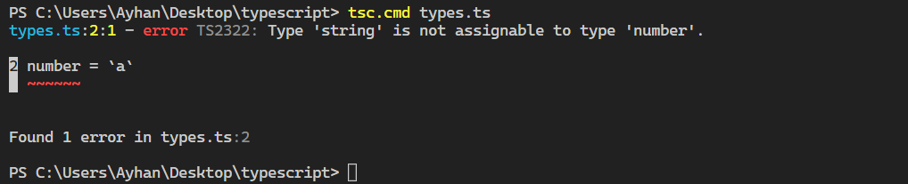

# Typescript Tutorial

### What is typescript ?

### TypeScript is a free and open source programming language developed and maintained by Microsoft. It is a strict syntactical superset of JavaScript and adds optional static typing to the language. It is designed for the development of large applications and transpiles to JavaScript

- Superset of javascript
- Transpiler
- Compile-time Error

### Superset Of Javascript

#### JavaScript is a scripting language which helps you create interactive web pages whereas TypeScript is a superset of JavaScript. TypeScript code needs to be compiled while JavaScript code doesn't need to compile.

### Transpiler

### Transpilers, or source-to-source compilers, are tools that read the sourcecode written in one programming language and produce the equivalent code in another programming language with a similar level of abstraction. A good example of transpiler is the Typescript transpiler which converts Typescript code to JavaScript

### Compile-time Error

### We all know that TypeScript is a language that compile itself to JavaScript. During compile-time TypeScript can emit errors to a terminal, and does not allow compiling of a code at all. Even if you are writing pure JavaScript code, we can still use TypeScript compiler to detect possible errors during compile-time, instead of testing and encountering them on run-time.

```js
let number = 4
number = `a`
```




## typescript start

-image

### open terminal

```js
npm install -g typescript
```

- create new folder
- create new file

#### the next step is to write the following codes in the file you created and then open the terminal

```js
//greeter.ts

function greeter(name) {
  console.log(`hello ${name}`)
}

let user = 'Ayhan'

greeter(user)
console.log('helloworld')
```

### after process , open the terminal

```js
tsc.cmd`filename`.ts
```

```js
// greeter.js
function greeter(name) {
  console.log('hello '.concat(name))
}
var user = 'Ayhan'
greeter(user)
console.log('helloworld')
```
